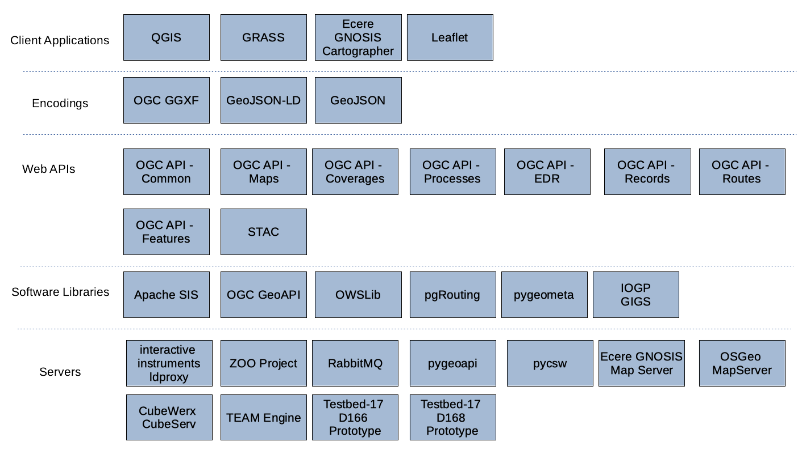

[[architecture]]
== High-Level Architecture

The focus of the sprint was on support of the development of the open geospatial standard across various open source software projects. Implementations of these draft standards were deployed in participants’ own infrastructure in order to build a solution with the architecture shown below in <<img_architecture>>.

[[img_architecture]]
.High Level Overview of the Sprint Architecture

As illustrated the sprint architecture was designed with the view of enabling client applications to connect to different servers that implement open geospatial standards such as the suite of OGC API standards. The architecture also included several different software libraries that support open geospatial standards and enable the extraction, transformation and loading of geospatial data.
The rest of this section describes the software deployed and standards implemented during the code sprint.

=== Approved OGC Standards

This section describes the approved OGC standards implemented during the code sprint.

==== OGC API - Features

The OGC API - Features standard offers the capability to create, modify, and query spatial data on the Web and specifies requirements and recommendations for APIs that want to follow a standard way of sharing feature data. The specification is a multi-part standard. Part 1, labelled the Core, describes the mandatory capabilities that every implementing service has to support and is restricted to read-access to spatial data that is referenced to the World Geodetic System 1984 (WGS 84) Coordinate Reference System (CRS). Part 2 enables the use of different CRS, in addition to the WGS 84. Additional capabilities that address specific needs will be specified in additional parts. Envisaged future capabilities include, for example, support for creating and modifying data, more complex data models, and richer queries.

The OGC API - Features standard is part of the OGC API family of standards. OGC API standards define modular API building blocks to spatially enable Web APIs in a consistent way. The standards make use of the OpenAPI specification for defining the API building blocks.

==== OGC API - Environmental Data Retrieval

An Environmental Data Retrieval (EDR) API provides a family of lightweight interfaces to access environmental data resources. Each resource addressed by an EDR API maps to a defined query pattern. The OGC API – Environmental Data Retrieval standard identifies resources, captures compliance classes, and specifies requirements that are applicable to environmental data retrieval. The standard addresses two fundamental operations; discovery and query of environmental data resources. Discovery operations allow the API to be interrogated to determine its capabilities and retrieve information (metadata) about this distribution of a resource. This includes the API definition of the server as well as metadata about the environmental data resources provided by the server. Query operations allow environmental data resources to be retrieved from the underlying data store based upon simple selection criteria, defined by this standard and selected by the client. The OGC API – Environmental Data Retrieval standard is part of the OGC API family of standards. The OGC API – Environmental Data Retrieval standard is part of the OGC API family of standards.

====  OGC API - Processes

The OGC API - Processes standard enables the execution of computing processes and the retrieval of metadata describing their purpose and functionality. Typically, these processes combine raster, vector, and/or coverage data with well-defined algorithms to produce new raster, vector, and/or coverage information. The OGC API – Processes specification is part of the OGC API family of standards.

====  OGC GeoAPI

The GeoAPI Implementation Standard defines the normalized use of the GeoAPI library. The GeoAPI library contains a series of interfaces and classes in the Java programming language defined in several packages which interpret into Java the data model and Unified Modeling Language (UML) types that are specified in ISO and OGC standards documents. The library includes extensive Javadoc code documentation which complements the implementation of the ISO/OGC specifications by explaining particularities of the GeoAPI library: interpretations made of the specifications where there was room for choice, constraints due to the library’s use of Java, or standard patterns of behavior expected by the library, notably in its handling of return types during exceptional situations.

In this code sprint, the GeoAPI implementors focused on support for the GIGS specification.

=== Draft OGC Specifications

This section describes the draft OGC specifications implemented during the code sprint.

==== OGC API - Common

The draft OGC API - Common specification documents the set of common practices and shared requirements that have emerged from the development of Resource Oriented Architectures and Web APIs within the OGC. The draft OGC API - Common specification is part of the OGC API family of standards. The specification serves as a common foundation upon which all OGC APIs will be built. Consistent with the architecture of the Web, this specification uses a resource architecture that conforms to principles of Representational State Transfer (REST). The draft OGC API – Common specification establishes a common pattern that leverages the OpenAPI specification for describing APIs.

==== OGC API - Coverages

The OGC API - Coverages specification defines a Web API for accessing coverages that are modeled according to the Coverage Implementation Schema (CIS) 1.1. Coverages are represented by some binary or ASCII serialization, specified by some data (en-coding) format. Arguably the most popular type of coverage is that of a gridded coverage. Gridded coverages have a grid as their domain set describing the direct positions in multi-dimensional coordinate space, depending on the type of grid. Satellite imagery is typically modeled as a gridded coverage, for example. The draft OGC API - Coverages specification is part of the OGC API family of standards.

==== OGC API - Maps

The draft OGC API - Maps standard describes an API that presents maps portraying data that has been rendered according to a style. The maps served by implementations of the draft OGC API - Maps standard are retrieved as images of any size, generated on-the-fly, and with the styling determined by the client application. The draft standard can be considered the successor to the widely implemented WMS standard. The draft OGC API – Maps specification is part of the OGC API family of standards.

==== OGC API - Records

OGC API - Records provides discovery and access to metadata records about resources such as features, coverages, tiles / maps, models, assets, services or widgets. The draft specification enables the discovery of geospatial resources by standardizing the way collections of descriptive information about the resources (metadata) are exposed. The draft specification also enables the discovery and sharing of related resources that may be referenced from geospatial resources or their metadata by standardizing the way all kinds of records are exposed and managed. The draft OGC API – Records specification is part of the OGC API family of standards.

==== OGC API - Routes

OGC API - Routes describes the requirements for interoperable web-based route computation and specifies a number of alternative approaches to fulfill these requirements. One of the approaches is based on the current draft of the draft OGC API - Processes - Part 1: Core specification while the other comprises a specialized API although also based on the draft OGC API - Common - Part 1: Core specification. Both approaches facilitate a common Route Exchange Model (REM) that is based on GeoJSON.

==== OGC API - Tiles

OGC API - Tiles references the OGC Two Dimensional Tile Matrix Set (TMS) standard. The TMS standard defines the rules and requirements for a tile matrix set as a way to index space based on a set of regular grids defining a domain (tile matrix) for a limited list of scales in a CRS. The draft OGC API – Tiles specification is part of the OGC API family of standards.

==== OGC Gridded Geodetic Data Exchange Format (GGXF)

The purpose of the Gridded Geodetic Data Exchange Format (GGXF) project team is to design a file structure and computer storage mechanism for the efficient exchange of regularly gridded geodetic data.

=== OSGeo Projects
This section describes software, by OSGeo Projects, that was deployed during the code sprint.

include::architecture/grass.adoc[]
include::architecture/mapserver.adoc[]
include::architecture/postgis.adoc[]
include::architecture/proj.adoc[]
include::architecture/pycsw.adoc[]
include::architecture/qgis.adoc[]

=== OSGeo Community Projects

This section describes software, by OSGeo Community Projects, that was deployed during the code sprint.

include::architecture/leaflet.adoc[]
include::architecture/owslib.adoc[]
include::architecture/pgrouting.adoc[]
include::architecture/pygeoapi.adoc[]
include::architecture/pygeometa.adoc[]
include::architecture/teamengine.adoc[]
include::architecture/zooproject.adoc[]

=== ASF Projects

This section describes software, by ASF Projects, that was deployed during the code sprint.

include::architecture/apachesis.adoc[]

=== Other open source products

include::architecture/ldproxy.adoc[]
include::architecture/rabbitmq.adoc[]
include::architecture/T17D166.adoc[]
include::architecture/T17D168.adoc[]

=== Proprietary products

include::architecture/cubeserv.adoc[]
include::architecture/gnosis.adoc[]
