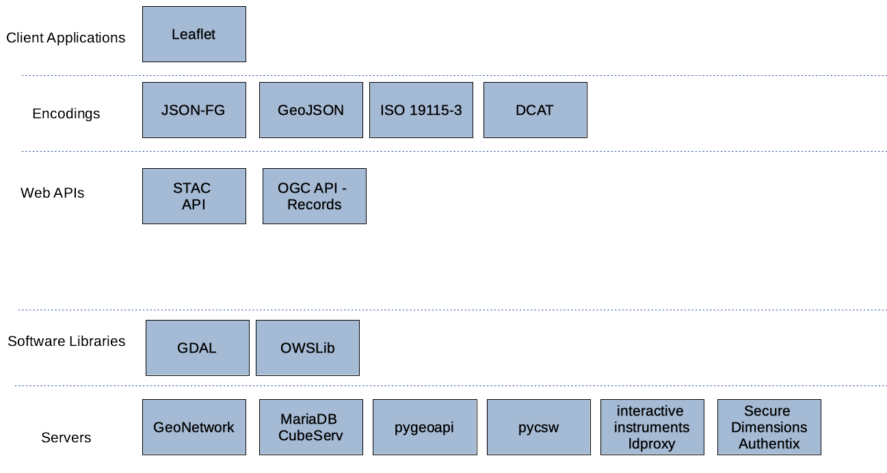

[[architecture]]
== High-Level Architecture

The focus of the sprint was on the support of implementations of open geospatial standards across various open source software projects. Implementations of approved and candidate OGC Standards were deployed in participants’ own infrastructure in order to build a solution with the architecture shown below in <<img_architecture>>.

[[img_architecture]]
.High Level Overview of the Sprint Architecture

As illustrated, the sprint architecture was designed with the view of enabling client applications to connect to different servers that implement open geospatial standards such as the suite of OGC API standards. The architecture also included several different software libraries that support open geospatial standards and enable the extraction, transformation and loading of geospatial data.
The rest of this section describes the software deployed and standards implemented during the code sprint.

=== Approved and Draft Standards

This section describes the approved and draft standards implemented during the code sprint.

==== OGC API - Records

The draft https://ogcapi.ogc.org/records[OGC API - Records] standard provides discovery and access to metadata records about resources such as features, coverages, tiles / maps, models, assets, services or widgets. The draft specification enables the discovery of geospatial resources by standardizing the way collections of descriptive information about the resources (metadata) are exposed. The draft specification also enables the discovery and sharing of related resources that may be referenced from geospatial resources or their metadata by standardizing the way all kinds of records are exposed and managed. OGC API - Records can be considered the future successor to the widely implemented Catalogue Services for the Web (CSW) standard.

==== JSON-FG

JSON-FG (Features and Geometry JSON) extends GeoJSON to support a limited set of additional capabilities that are out-of-scope for GeoJSON, but that are important for a variety of use cases involving feature data.

==== ISO 19115

TBA

==== STAC

TBA

=== Open Source Software Projects

This section describes open source software products that were deployed during the code sprint.

include::architecture/geonetwork.adoc[]
include::architecture/ldproxy.adoc[]
include::architecture/leaflet.adoc[]
include::architecture/pygeoapi.adoc[]
include::architecture/pygeometa.adoc[]

=== Proprietary products

This section describes proprietary software products that were deployed during the code sprint.

include::architecture/cubeserv.adoc[]
