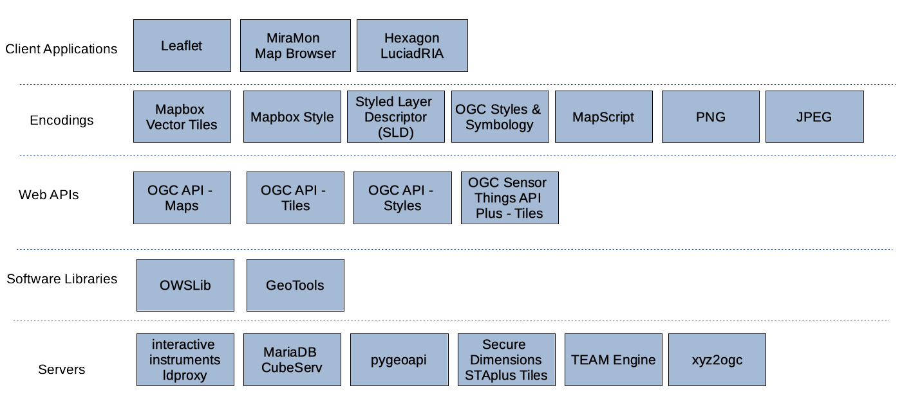

[[architecture]]
== High-Level Architecture

As illustrated in <<img_architecture>>, the sprint architecture was designed with the view of enabling client applications to connect to different servers that implement open geospatial standards that relate to web mapping, styles, and symbology. Implementations of OGC API - Maps, OGC API - Tiles and OGC API - Styles were deployed in participants' own infrastructure in order to build a solution with the architecture shown below in <<img_architecture>>.

[[img_architecture]]
.High Level Overview of the Sprint Architecture

The rest of this section describes the software deployed and standards implemented during the code sprint.

=== Approved and Draft Standards

This section describes the approved and draft standards implemented during the code sprint.

include::architecture/ogcapi_maps.adoc[]

include::architecture/ogcapi_styles.adoc[]

include::architecture/ogcapi_tiles.adoc[]

include::architecture/ogcstaplus.adoc[]

include::architecture/ogcsld.adoc[]

include::architecture/ogcstylessymbology.adoc[]

=== Open Source Software Projects

This section describes open source software products that were deployed during the code sprint.

include::architecture/leaflet.adoc[]

include::architecture/ldproxy.adoc[]

include::architecture/miramon.adoc[]

include::architecture/owslib.adoc[]

include::architecture/pygeoapi.adoc[]

include::architecture/staplusviewer.adoc[]

include::architecture/teamengine.adoc[]

include::architecture/openlayers.adoc[]

include::architecture/xyz2ogc.adoc[]

=== Proprietary products

This section describes proprietary software products that were deployed during the code sprint.

include::architecture/cubeserv.adoc[]

include::architecture/os_implementation_of_ogcapi_styles.adoc[]

include::architecture/gnosis.adoc[]

include::architecture/luciadria.adoc[]
