// If obligation is not specified, "normative" is taken by default
[appendix,obligation="informative"]
[[annex_a]]
== Styles and Symbology Use Cases

This annex presents the Styles and Symbology use cases that were discussed and documented during the code sprint.

=== Graduated and Categorized: conditional coloring of a map

This use case is discussed in https://github.com/opengeospatial/styles-and-symbology/issues/17[styles-and-symbology#Issue 17].

Existing conformance classes required for this use case:

* Symbology Core: Class Symbolizer
* Example stylesheet:

Describe any capability not already addressed by existing conformance classes:

*  Categorized: coloring map according to a unique value eg. coloring map according to region name (unique value)
* Graduated: coloring map according to a range of values eg. coloring map according to the population of a zone in a particular range(0-5000, 5000-10000)

Example image illustrating the portrayal use case:

* Categorized:

[[img_symcore_issue17a]]
.Categorized conditional coloring of a map
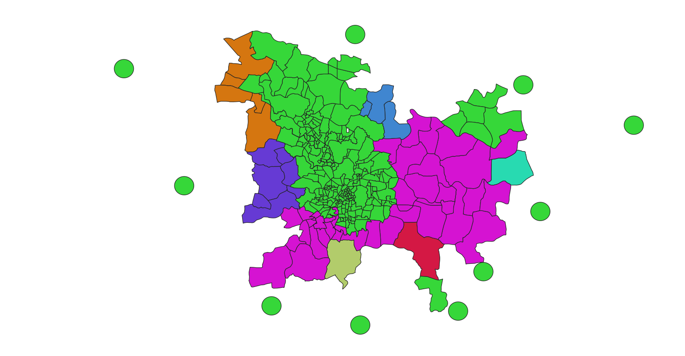

* Graduated

[[img_symcore_issue17b]]
.Graduated conditional coloring of a map
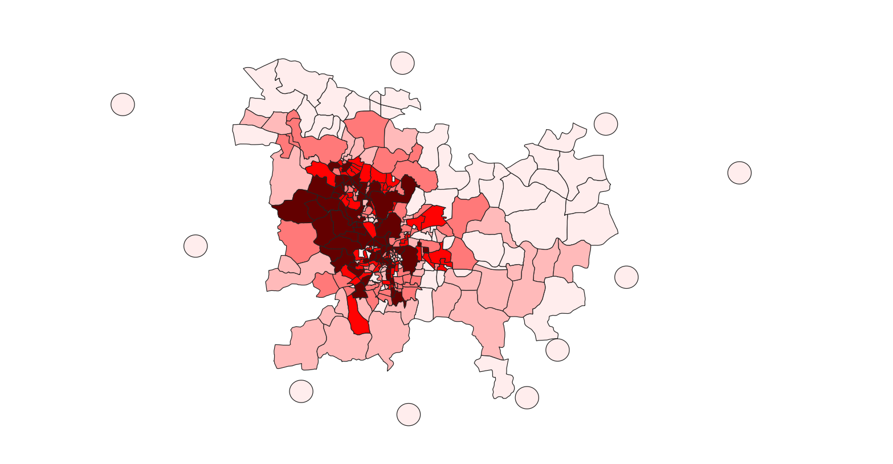

One possible solution is that when classes are unknown (in a raster map) then pixel gradient values can be used to group the pixels into classes and to color them according to that class, creating a choropleth or graduated map. In this use case, the vector data is presented as graduated (colour maps) even where there is a large number of unknown classes.

=== Unique values map

This use case is discussed in https://github.com/opengeospatial/styles-and-symbology/issues/18[styles-and-symbology#Issue 18].

Existing conformance classes required for this use case:

* basic vector feature styling

Example stylesheet:

Below a CSS encoding to describe a unique values map to display Local Climate Zones type (LCZ_PRIMARY property).

[source,css]
----
/* Metadata
* @title Local Climate Zones I
* @abstract Local Climate Zones I
*/

/* Main rule*/

* {
  stroke: rgb(255,255,255);
  stroke-width: 0.26;

/* Styling according to the Local Climate Zones */

  /* @title LCZ 1: Compact high-rise */
  [LCZ_PRIMARY = 1] {
    fill: rgb(139, 1, 1);
  };
  /* @title LCZ 2: Compact mid-rise */
  [LCZ_PRIMARY = 2] {
    fill: rgb(204, 2, 0);
  };
  /* @title LCZ 3: Compact low-rise */
  [LCZ_PRIMARY = 3] {
    fill: rgb(252, 0, 1);
  };
  /* @title LCZ 4: Open high-rise */
  [LCZ_PRIMARY = 4] {
    fill: rgb(190, 76, 3);
  };
  /* @title LCZ 5: Open mid-rise */
  [LCZ_PRIMARY = 5] {
    fill: rgb(255, 102, 2);
  };
  /* @title LCZ 6: Open low-rise */
  [LCZ_PRIMARY = 6] {
    fill: rgb(255, 152, 86);
  };
  /* @title LCZ 7: Lightweight low-rise */
  [LCZ_PRIMARY = 7] {
    fill: rgb(251, 237, 8);
  };
  /* @title LCZ 8: Large low-rise */
  [LCZ_PRIMARY = 8] {
    fill: #bcbcba;
  };
  /* @title LCZ 9: Sparsely built */
  [LCZ_PRIMARY = 9] {
    fill: rgb(188, 188, 186);
  };
  /* @title LCZ 10: Heavy industry */
  [LCZ_PRIMARY = 10] {
    fill: rgb(87, 85, 90);
  };
  /* @title LCZ A: Dense trees */
  [LCZ_PRIMARY = 101] {
    fill: rgb(0, 103, 0);
  };
  /* @title LCZ B: Scattered trees */
  [LCZ_PRIMARY = 102] {
    fill: rgb(5, 170, 5);
  };
  /* @title LCZ C: Bush,scrub */
  [LCZ_PRIMARY = 103] {
    fill: rgb(100, 132, 35) ;
  };
  /* @title LCZ D: Low plants */
  [LCZ_PRIMARY = 104] {
    fill: rgb(187, 219, 122);
  };
  /* @title LCZ E: Bare rock or paved */
  [LCZ_PRIMARY = 105] {
    fill: rgb(1, 1, 1);
  };
  /* @title LCZ F: Bare soil or sand */
  [LCZ_PRIMARY = 106] {
    fill: rgb(253, 246, 174);
  };
  /* @title LCZ G: Water */
  [LCZ_PRIMARY = 107] {
    fill: rgb(109, 103, 253);
  };
}

----

Describe any capability not already addressed by existing conformance classes:

Example image illustrating the portrayal use case:

[[img_symcore_issue18a]]
.Unique values map
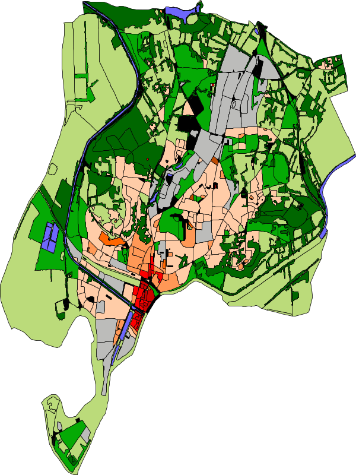

Material:
Data : https://github.com/orbisgis/POC-Carto/blob/main/data/rsu_lcz.geojson

Tool : https://github.com/orbisgis/POC-Carto
Based on Geotools library

=== Choropleth or graduated map

This use case is discussed in https://github.com/opengeospatial/styles-and-symbology/issues/19[styles-and-symbology#Issue 19].

Existing conformance classes required for this use case:

* basic vector feature styling

Example stylesheet:

Below a CSS encoding to describe a graduated map to display fraction of vegetation on a grid (HIGH_VEGETATION_FRACTION property).

[source,css]
----
*{
  stroke: #000000;
  stroke-width: 1px;
  [HIGH_VEGETATION_FRACTION>=0 OR HIGH_VEGETATION_FRACTION<=0.200]
  {
     fill: yellow;
  };
  [HIGH_VEGETATION_FRACTION>0.200 OR HIGH_VEGETATION_FRACTION<0.500]
  {
     fill: orange;
  };
  [HIGH_VEGETATION_FRACTION>0.500]
  {
     fill: red;
  };
}

----

Describe any capability not already addressed by existing conformance classes:

Example image illustrating the portrayal use case:

[[img_symcore_issue19a]]
.Choropleth or graduated map
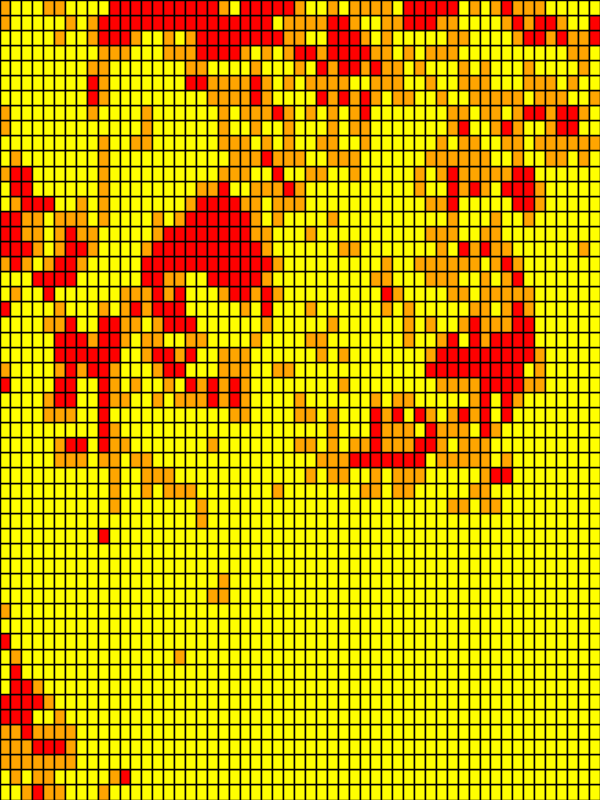

=== Proportional symbol

This use case is discussed in https://github.com/opengeospatial/styles-and-symbology/issues/20[styles-and-symbology#Issue 20].

Existing conformance classes required for this use case:

* vector feature styling
* viz/feature.pass (define conformance classes) 🧨
* geometry selection 🧨
* Geometry Manipulation Functions (centroid 🧨)
* Interpolate function 🧨
* Shape Graphics

Example stylesheet:

Below a CSS encoding to describe a proportional symbol map to display number of inhabitants on a regular grid (SUM_POP property).

[source,css]
----
*{
  stroke: grey;
  stroke-width: 1px;
  [SUM_POP>0] {
    geometry: centroid(the_geom);
    mark:   symbol(circle);
    mark-size: [Interpolate(
         SUM_POP,
         0, 10,
         30, 20,
         84, 100,
         'numeric',
         'linear')];
   :mark {
       fill: orange;
       fill-opacity: 0.2;
       stroke: black;
       stroke-width : 1px;
     }
  }
}
----

Describe any capability not already addressed by existing conformance classes:

Example image illustrating the portrayal use case:

[[img_symcore_issue20a]]
.Proportional symbol
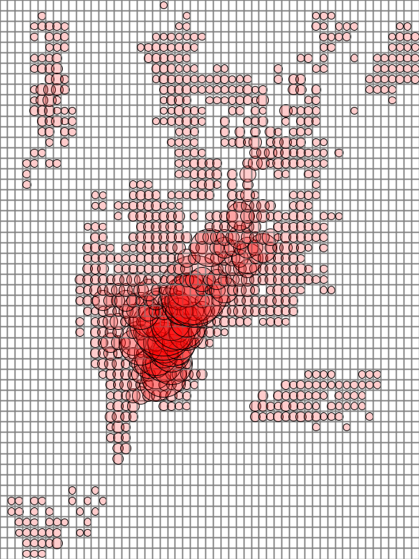

=== Proportional bivariate map

This use case is discussed in https://github.com/opengeospatial/styles-and-symbology/issues/21[styles-and-symbology#Issue 21].

Existing conformance classes required for this use case:

Not specified.

Example stylesheet:

Below a CSS encoding to describe a proportional symbol map with a color for each Local Climate Zones type filtered to represent a climate aleas.

[source,css]
----
*{
 [LCZ_PRIMARY != 104]{
   stroke: grey;
   stroke-width: 1px;
 }
 [SUM_POP>0] {
    geometry: centroid(the_geom);
    mark:   symbol(circle);
    mark-size: [Interpolate(
         SUM_POP,
         0, 10,
         30, 20,
         84, 100,
         'numeric',
         'linear')];
 };
 /* @title high climate risk */
 [LCZ_PRIMARY = 1],
 [LCZ_PRIMARY = 2],
 [LCZ_PRIMARY = 3],
 [LCZ_PRIMARY = 10],
 [LCZ_PRIMARY = 105]{
   :mark{
     fill: red;
   }
 };

 /* @title moderate climate risk */
 [LCZ_PRIMARY = 4],
 [LCZ_PRIMARY = 5],
 [LCZ_PRIMARY = 6],
 [LCZ_PRIMARY = 7],
 [LCZ_PRIMARY = 8],
 [LCZ_PRIMARY = 9]{
   :mark{
     fill: orange;
   }
 };

 /* @title low climate risk */
 [LCZ_PRIMARY = 101],
 [LCZ_PRIMARY = 102],
 [LCZ_PRIMARY = 103],
 [LCZ_PRIMARY = 106],
 [LCZ_PRIMARY = 107]{
   :mark{
     fill: green;
   }
 };
 }
----

Describe any capability not already addressed by existing conformance classes:

Example image illustrating the portrayal use case:

[[img_symcore_issue21a]]
.Proportional bivariate map
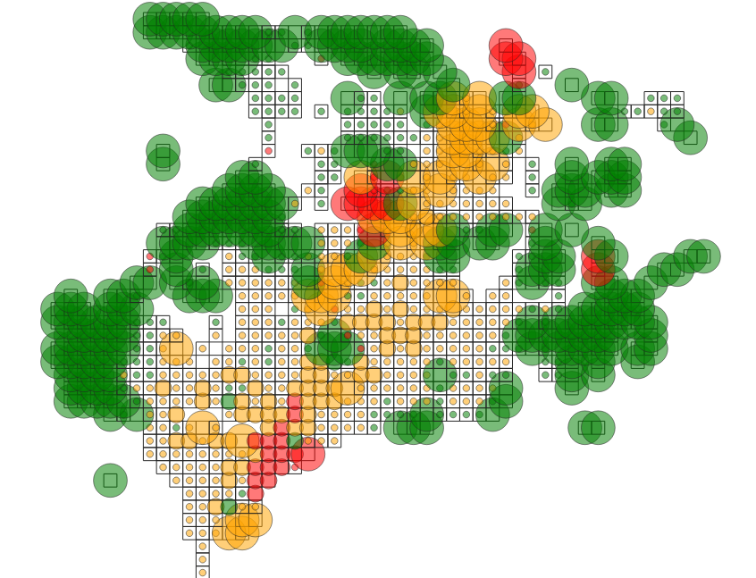

=== Dot map density

This use case is discussed in https://github.com/opengeospatial/styles-and-symbology/issues/22[styles-and-symbology#Issue 22].

Existing conformance classes required for this use case:

* Dashes, Stipples, Hatches and Gradients
* (conformance class for more specific stippling)

Example stylesheet:

Bellow a CSS encoding to describe a dot map. A do map is used to create a visual impression of density by placing a dot or some other symbol in the approximate location of one or more instances of the variable being mapped.
The mapped variable is the area of the LCZ geometry.
The dot map can be colored according the LCZ types. a.e : LCZ equals to 1, 2 , 3 filled in red to represent a high climate aleas.

Describe any capability not already addressed by existing conformance classes:

DotFill must be defined with the following properties

* quantityPerMark : the quantity represented by a single dot.
* totalQuantity : the total quantity to be represented.
* mode : the algorithm to distribute the mark random, grid...
a mark or a set of marks

Example image illustrating the portrayal use case:

[[img_symcore_issue22a]]
.Dot map density
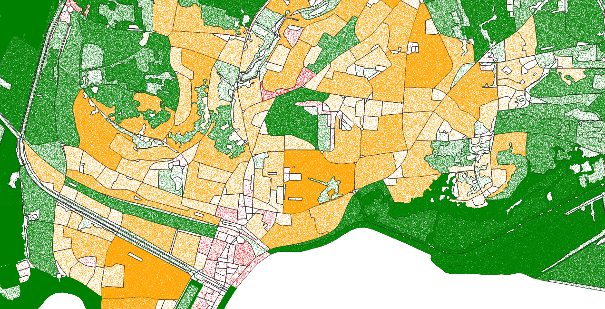

=== Bivariate proportional symbol

This use case is discussed in https://github.com/opengeospatial/styles-and-symbology/issues/23[styles-and-symbology#Issue 23].

Existing conformance classes required for this use case:

Example stylesheet:

Bivariate map is a technique in cartography to display two different thematic variables at the same time. One of the most commun technique to create a bivariate map is to combine of visual variables. For most cartographers it may better support different map reading tasks. The following map uses the same visual variable to represent two variables (Half Circle). It permits a cross-variable comparison between the number of permits in 2005 and 2014.

[source,css]
----
*{
  stroke: grey;
  stroke-width: 1px;
  [NB_PERMITS_2005>0] {
    geometry: centroid(the_geom);
    mark:   symbol(semicircle);
    mark-size: [Interpolate(
         NB_PERMITS_2005,
         0, 10,
         659, 100,
         'numeric',
         'linear')];
   :mark {
       fill: rgb(153, 153, 255);
       fill-opacity: 0.2;
       stroke: black;
       stroke-width : 1px;
     }
  };
    [NB_PERMITS_2014>0] {
      geometry: centroid(the_geom);
      mark:   symbol(semicircle);
      mark-size: [Interpolate(
           NB_PERMITS_2014,
           0, 10,
           659, 100,
           'numeric',
           'linear')];
     :mark {
         fill: rgb(102, 0, 204);
         fill-opacity: 0.2;
         stroke: black;
         stroke-width : 1px;
         rotation: 180deg;
       }
    }
}
----

Describe any capability not already addressed by existing conformance classes:

Example image illustrating the portrayal use case:

[[img_symcore_issue23a]]
.Bivariate proportional symbol
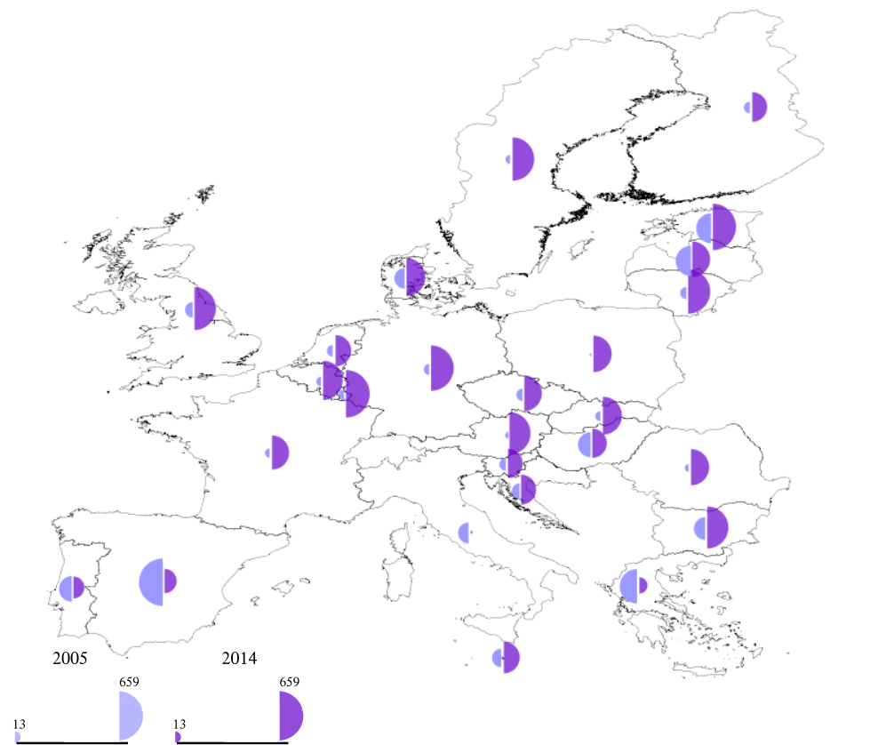

An additional example is presented below.

[[img_symcore_issue23b]]
.Additional example of Bivariate proportional symbol
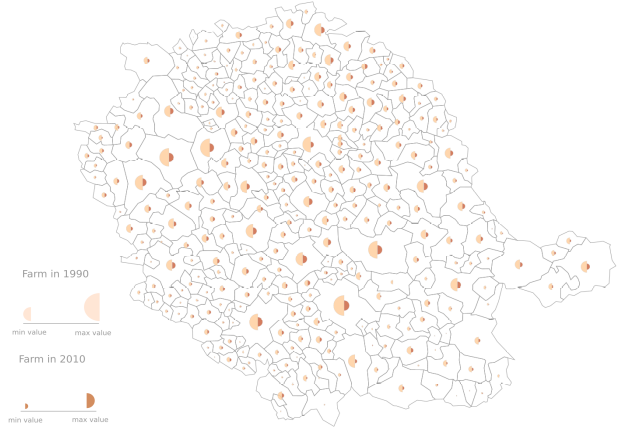

=== Custom fill

This use case is discussed in https://github.com/opengeospatial/styles-and-symbology/issues/24[styles-and-symbology#Issue 24].

Existing conformance classes required for this use case:

Example stylesheet:
The following map shows assembled visual variables expressed with custom fills : Graphic Fill and Hatched Fill.

Describe any capability not already addressed by existing conformance classes:

HatchedFill must be defined with the following properties

* angle : the orientation of the hatches
* distance : the perpendicular distance between two hatches
* offset : the offset of the hatches.
* stroke

Example image illustrating the portrayal use case:

[[img_symcore_issue24a]]
.Custom fill
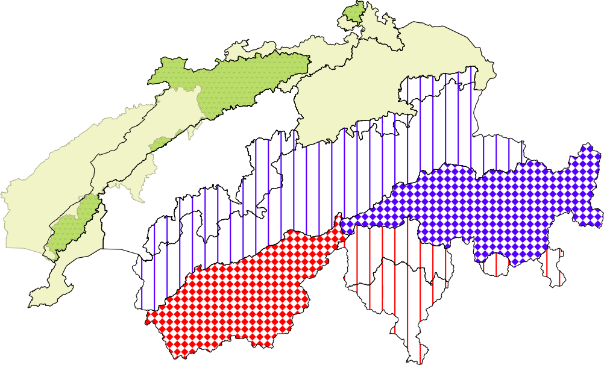

An additional example of Custom fill is shown below.

[[img_symcore_issue24b]]
.Another example of Custom fill
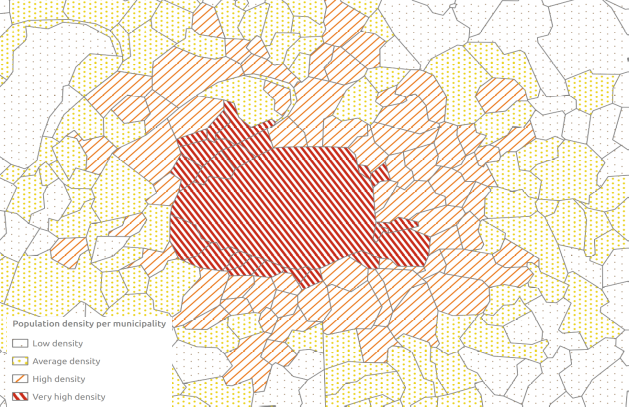

=== Proportional colored text

This use case is discussed in https://github.com/opengeospatial/styles-and-symbology/issues/25[styles-and-symbology#Issue 25].

Existing conformance classes required for this use case:

Example stylesheet:

Proportional label map uses the same technique than proportional symbols, expected that the size of the font is scaled proportionately.

Here we describe a CSS file that represents the Local Climate Zone types with a text and a color according a climate aleas.

[source,css]
----
*{
     stroke: grey;
     stroke-width: 0.26;
     label: [LCZ_PRIMARY];
     font-family: Arial;
     font-size: [Interpolate(
                           area(geometry)/10000,
                           0, 10,
                           5, 20,
                           10, 32,
                           'numeric',
                           'linear')];
      font-style: normal;
      font-weight: bold;
      font-fill: black;
      label-anchor: 0.5 0.5;
      label-auto-wrap: 60;
      label-max-displacement: 150;

       /* @title high  */
          [LCZ_PRIMARY <= 4],
          [LCZ_PRIMARY = 8],
          [LCZ_PRIMARY = 10],
          [LCZ_PRIMARY = 105] {
              font-fill: red;
          };
          /* @title mid */
          [LCZ_PRIMARY >= 5]
          [LCZ_PRIMARY <= 7],
          [LCZ_PRIMARY = 9],
          [LCZ_PRIMARY = 10] {
           font-fill :orange;
          };
          /* @title low */
          [LCZ_PRIMARY >= 101]
          [LCZ_PRIMARY <= 104],
          [LCZ_PRIMARY = 107]{
            font-fill:  green;
          }
}
----

Describe any capability not already addressed by existing conformance classes:

Example image illustrating the portrayal use case:

[[img_symcore_issue25a]]
.Proportional colored text
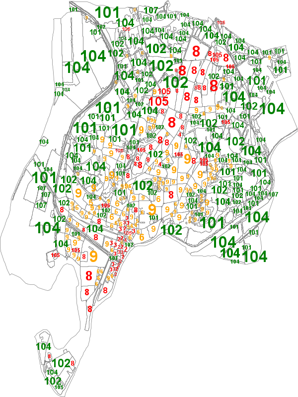
