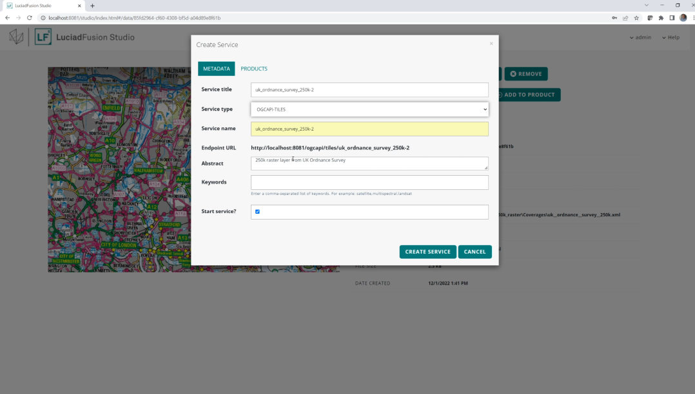
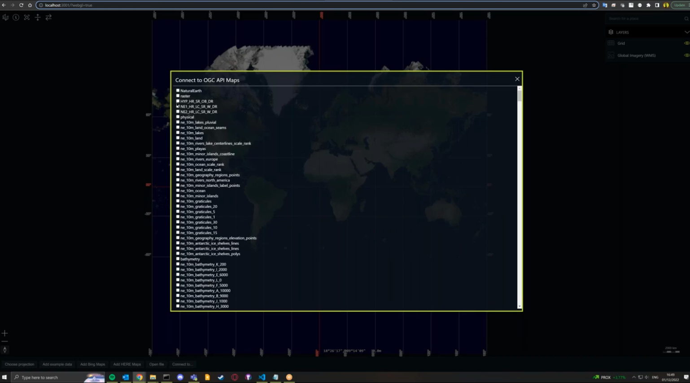
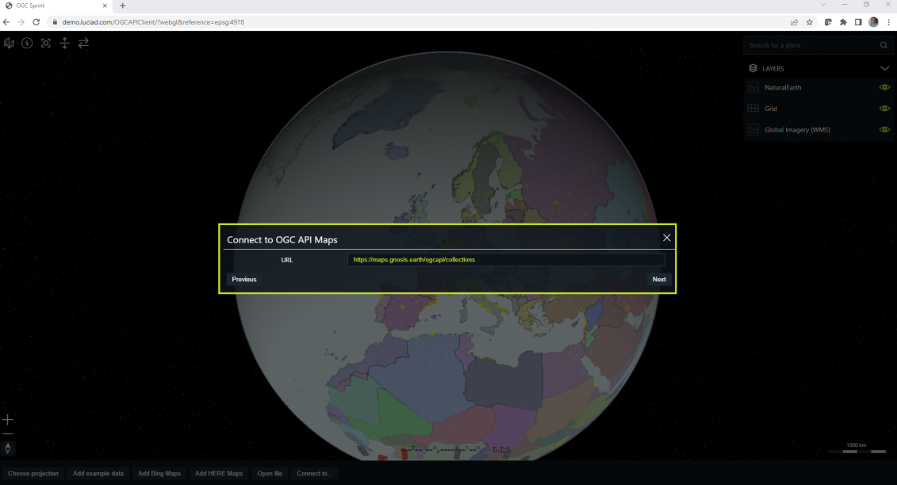
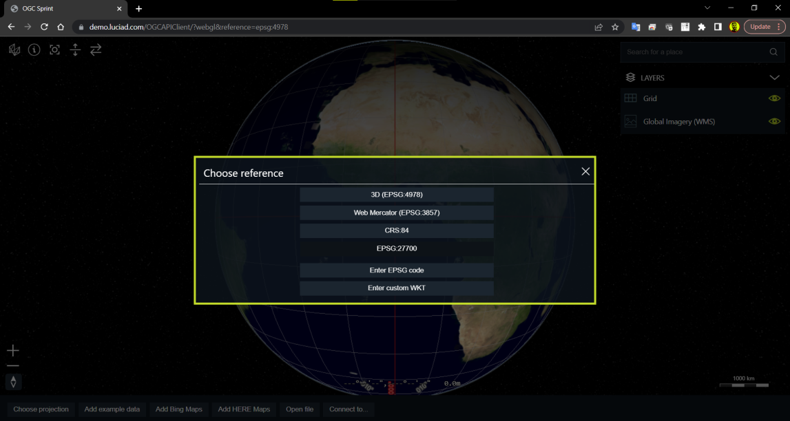
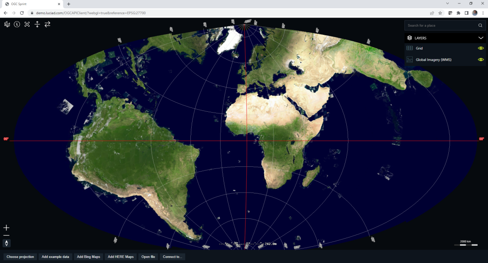
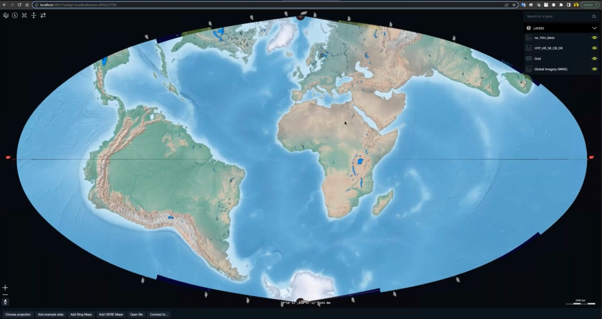

= Hexagon - LuciadFusion/LuciadRIA

== Contribution

The sprint participants from https://www.hexagon.com[Hexagon], Robin Houtmeyers and Tom Crauwels, divided their efforts between the server side and the client side. On the server side they integrated _OGC API - Tiles_ as a possible service option in https://hexagon.com/products/luciadfusion[LuciadFusion] Studio. On the client side they created a prototype connector for the _OGC API -  Maps_ candidate Standard and the _OGC API - Tiles_ Standard in https://hexagon.com/products/luciadria[LuciadRIA] and integrated the connector into the https://dev.luciad.com/portal/packed-samples/ria/dataformats/index.html?webgl&reference=epsg:4978[LuciadRIA Data Formats sample]. More developer focused information such as documentation, API reference, samples, videos, etc can be found on https://dev.luciad.com/ .

== Server side with LuciadFusion

LuciadFusion provides an all-in-one server solution for geospatial data management. At it's core is an API that can be used to develop custom server solutions. It ships with LuciadFusion Studio, an out-of-the-box web frontend application developed on top of that API, that lets an end-user manage data intelligently, store and process a multitude of data formats and feed data to multiple applications. A demonstration video can be found https://share.vidyard.com/watch/Cgwu3cpEbW4Nuoj4uDfgP8?[here].

The sprint participants from Hexagon started from an earlier prototype that could offer data through an OGC API - Tiles interface. The goal of the earlier prototype was a proof of concept, a document that explains how to add support for OGC API Tiles and a rough estimate of the workload. Since OGC API Tiles is defined using the OpenAPI specification, we could use this OpenAPI specification and the tool https://github.com/OpenAPITools/openapi-generator[OpenAPI generator] to generate domain models and REST controllers (for example: Spring controllers). 

During this sprint, that earlier prototype was integrated into LuciadFusion Studio as a proof of concept. This means that after adding or crawling data, it could be published as an OGC API Tiles service, next to existing services such as WMS, WMTS, etc. This functionality was demonstrated in a short video with sample data downloaded from UK Ordnance Survey: 

 https://osdatahub.os.uk/downloads/open/250kScaleColourRaster

Note: this is still work in progress; there is no out-of-the-box LuciadFusion prototype with OGC API support available yet. 

== Client side with LuciadRIA
=== Overview

LuciadRIA is a JavaScript API that uses WebGL and HTML5 to deliver desktop-like performance in geospatial applications on the web. A video demonstrating it in action can be found https://share.vidyard.com/watch/9s47KBZmR2N7wMwTYPeTH4?[here]. More developer oriented information, including live samples, can be found on our https://dev.luciad.com/portal/productDocumentation/LuciadRIA/docs/documentationoverview.html[Developer Platform].

We decided to extend the LuciadRIA Data Formats sample and worked towards integrating the OGC API Tiles & Maps into its data loading functionality, similar to the existing WMS and WMTS capabilities parsing. Once we could connect to one of the servers made available by the other participants, we implemented a model that could retrieve data and visualize it in a WebGLMap. We also tried to implement the vector tiling, but after some trials decided to forego it and use the remaining time to make sure the demo highlights our capability to visualize data on the fly in any projection. The demo is available https://demo.luciad.com/OGCAPIClient/?webgl&reference=epsg:4978[here].

=== Capability parsing

This new version of the OGC API offers a central overview of all data sets available on a server in JSON (or xml, html) at a "collections" URL. This central overview offers links to specific collections (with a unique ID) which in turn can offer links to maps, tiles, styles, etc. An overview from the GNOSIS Map Server:

[literal]
/ogcapi/collections/{collectionID}(collection description)
/ogcapi/collections/{collectionID}/tiles(vector tiles)
/ogcapi/collections/{collectionID}/tiles/{tileMatrixSetId}/{tileMatrix}/{tileRow}/{tileCol}.{format}(individual vector tile)
/ogcapi/collections/{collectionID}/map/tiles(map tiles)
/ogcapi/collections/{collectionID}/map/tiles/{tileMatrixSetId}/{tileMatrix}/{tileRow}/{tileCol}.{format}(individual map tile)
/ogcapi/collections/{collectionID}/coverage/tiles(map tiles)
/ogcapi/collections/{collectionID}/coverage/tiles/{tileMatrixSetId}/{tileMatrix}/{tileRow}/{tileCol}.{format}(individual coverage tile)
/ogcapi/collections/{collectionID}/items(vector features)
/ogcapi/collections/{collectionID}/coverage(coverage)
/ogcapi/collections/{collectionID}/map(map)
/ogcapi/collections/{collectionID}/styles/{styleId}/map(styled layer map)
/ogcapi/map(dataset map)
/ogcapi/styles/{styleId}/map(styled dataset map)
/ogcapi/tileMatrixSets/{tileMatrixSetId}(individual tiling scheme)

In the Data Formats sample we created a ConnectToOGCAPIMapsWizard and added it to the ConnectToModal. This wizard will create a OGCAPIMapsCapabilities object after connecting to a valid URL, which will contain a collection of OGCAPIMapsCapabilitiesLayer's, one for each collection available. Finally a OGCAPIMapsLoader will be used to create a model and layer that LuciadRIA can use to load and visualize the data.

=== Retrieving tiles

Retrieving data can be done in 2 distinct ways: /map or /tiles. The first way, /map, is very similar to how WMS works, you can request data for a certain bounding box. The newer way, available at /tiles, is similar to how many popular map servers, such as OSM, work. The tiles are cut using a certain tile matrix set (https://www.ogc.org/standards/tms) and can then be requested using a format as such:

 collections/{collectionID}/tiles/{tileMatrixSetId}/{tileMatrix}/{tileRow}/{tileCol}.{format}

So for example:

 collections/bluemarble/tiles/WebMercatorQuad/0/0/0.png

Multiple tile matrix sets can be offered and their specifications can be requested (in JSON or HTML). The specification offers the width and height of tiles, the number of columns and rows, the scale and a way to calculate the bounding box, so everything you need to calculate each tile. In our example implementation we just focused on the classic quad tree structure such as WebMercatorQuad.

:UrlTileSetModel: https://dev.luciad.com/portal/productDocumentation/LuciadRIA/docs/reference/LuciadRIA/classes/_ria_model_tileset_urltilesetmodel_d_.urltilesetmodel.html

We extended from {UrlTileSetModel}[UrlTileSetModel] to implement such a connection. It would map easily on the /tiles offering, since it works exactly like that. To connect to the /maps offering, we used the function getTileBounds to calculate the bounds of a certain tile and then replace the URL so that it matches the OGC API Maps standard and send a bounding box (with crs) to the server.

=== Vector tiling

This new OGC API can also offer vector tiles. The tiling structure is similar for imagery data and is equally available at /tiles, but instead of PNG images, you can retrieve GeoJSON. Since LuciadRIA has an out of the box connector for GeoJSON, it would be fairly straight forward to visualize those tiles. Since we have a UrlTileSetModel that can follow the needed tiling pattern, the plan was to use that to request tiles at the correct moment and then use the GeoJSON decoder to load and visualize them. However after some digging it turned out that while it is easy to get the correct tiles the first time, the functionality to switch back to lower detailed tiles while zooming out was unattainable. After writing some initial code to create our own tiling mechanism based on the Tile Matrix Set, we decided that it could not be completed within the sprint's timeframe and changed our focus. Note however that this would definitely be possible given some more time and access to the complete tiling mechanism used in UrlTileSetModel.

=== Reprojecting

One of the core strengths of the Luciad portfolio is that it can be used to connect to and visualize data in any format or projection. LuciadRIA can even utilize the power of the GPU through WebGL to on the fly project data, such as imagery and vector data, to any known projection and visualize it as such. To demonstrate this we added another menu option in the sample to switch to different projections. 

Next to some predefined options such as 3D, CRS84, WebMercator and a projection requested by another participant (British National Grid projection (EPSG:27700)), we also added the option to load any projection known to LuciadRIA. To minimize the size of a LuciadRIA application, not all projections are available in it out of the box. However, other projections can be added as WKT (Well Known Text)) by its identifier, which in most cases will be an EPSG code. If LuciadRIA does not know this code, it will automatically try to request it from https://epsg.io/ which is an Open Source project that holds a collection of all known projections and can format them into WKT. After getting the WKT, the application will be restarted in the new projection and any subsequently loaded data will be reprojected into that projection.

=== Conclusions

There are some obvious quality of life changes that come with this new API:

* The switch from XML to HTML/JSON is a very welcome one as parsing of JSON is much easier in web environments.
* Next to that the build in tiles definitely could definitely make it easier to load and visualize data.
* The addition of vector tiles also offers some obvious benefits over WFS.

All those benefits also come with some downsides, such as:

* The API offer so many options in terms of tiling, formats, structures, etc with quite some freedom for whoever implements it, that it could cause confusion or incompatibilities later on. For example a client that chooses to implement only a certain format and tiling structure may not be able to connect to a server that also only supports another format/tiling structure. 
* This freedom was also notable when parsing the metadata, sometimes links were absolute, sometimes relative, sometimes missing altogether.

== Resources

The LuciadRIA demonstration sample (= extended Data Formats sample) is available online:

 https://demo.luciad.com/OGCAPIClient/?webgl&reference=epsg:4978
 
Using the Connect to button at the bottom, you can add connections to OGC API Maps services.

The video created showcasing the LuciadFusion integration can be found here:

 https://hexmet-my.sharepoint.com/:v:/g/personal/robin_houtmeyers_hexagon_com/EXchVu0jsyFBiAMVf17xpmcBqjTV-WQHnX2uc17ckBan5w

Servers from other participants used during the sprint:

 GNOSIS Map Server: https://maps.gnosis.earth/ogcapi/
 CubeServ: https://test.cubewerx.com/cubewerx/cubeserv/demo/ogcapi/EuroRegionalMap
 
