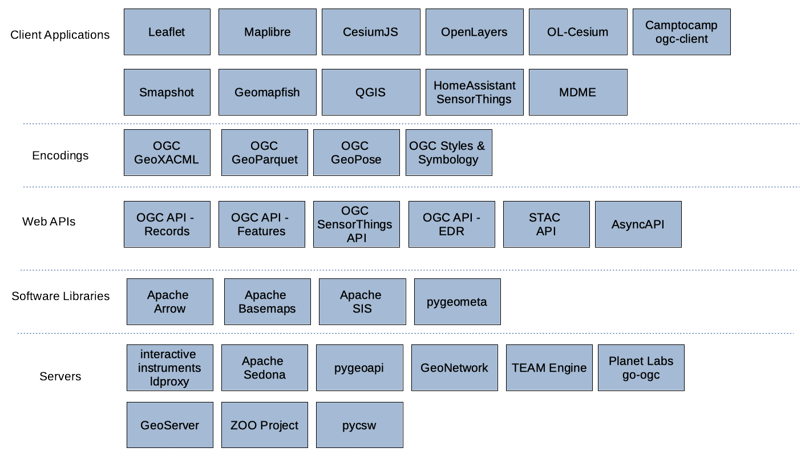

[[architecture]]
== High-Level Architecture

The focus of the sprint was on the support of implementations of open geospatial standards across various open source software projects. Implementations of approved and candidate OGC Standards were deployed in participants’ own infrastructure in order to build a solution with the architecture shown below in <<img_architecture>>. As illustrated, the sprint architecture was designed with the view of enabling client applications to connect to different servers that implement open geospatial standards. The architecture also included several different software libraries that support open geospatial standards and enable the extraction, transformation and loading of geospatial data.

[[img_architecture]]
.High Level Overview of the Sprint Architecture

The rest of this section describes the software deployed and standards implemented during the code sprint.

=== Approved OGC Standards

include::architecture/ogcsensorthingsapi.adoc[]

include::architecture/ogcapifeatures.adoc[]

include::architecture/ogcstylessymbology.adoc[]

include::architecture/geoxacml.adoc[]

=== Candidate OGC Standards

include::architecture/geopose.adoc[]

include::architecture/ogcapirecords.adoc[]

include::architecture/geoparquet.adoc[]

=== Other Specifications

include::architecture/asyncapi.adoc[]

include::architecture/stacapi.adoc[]

=== ASF Apache Projects

include::architecture/apachearrow.adoc[]

include::architecture/apachebaremaps.adoc[]

include::architecture/apachesedona.adoc[]

include::architecture/apachesis.adoc[]

=== OSGeo Projects

include::architecture/geonetwork.adoc[]

include::architecture/geoserver.adoc[]

include::architecture/openlayers.adoc[]

include::architecture/owslib.adoc[]

include::architecture/pycsw.adoc[]

include::architecture/pygeoapi.adoc[]

include::architecture/qgis.adoc[]

=== Community Open Source Projects

include::architecture/zooproject.adoc[]

include::architecture/teamengine.adoc[]

include::architecture/cesiumjs.adoc[]

include::architecture/leaflet.adoc[]

include::architecture/camptocampogc.adoc[]

include::architecture/homeassistantsensorthings.adoc[]

include::architecture/maplibre.adoc[]

include::architecture/mdme.adoc[]

include::architecture/olcesium.adoc[]

include::architecture/pygeometa.adoc[]

include::architecture/geomapfish.adoc[]

include::architecture/smapshot.adoc[]

include::architecture/go-ogc.adoc[]

include::architecture/gpq.adoc[]
