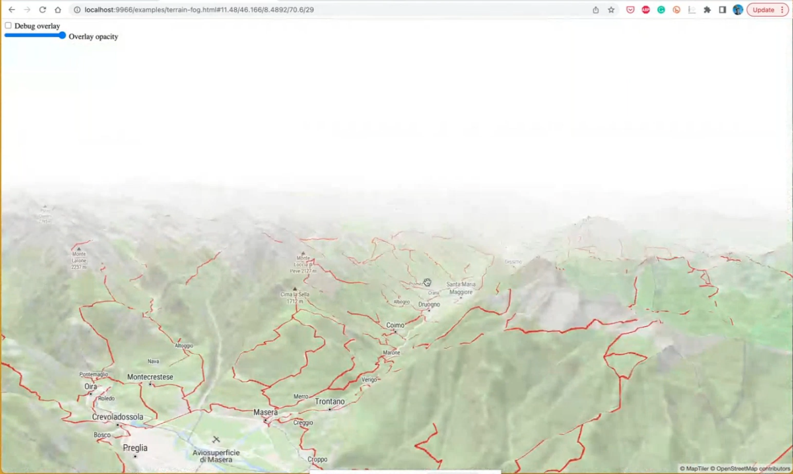

[[discussion]]
== Discussion

=== GIGS 

The GIGS tests can be found on the gigs.iogp.org website. The participants from Geomatys worked on https://github.com/OSGeo/PROJ-JNI[PROJ-JNI] to enable it to execute additional GIGS tests. PROJ is a coordinate transformation software package, built using C/C++ library, that transforms geospatial coordinates from one CRS to another. PROJ-JNI is a Java Native Interface for PROJ. 

[[img_gigs_discussion]]
.Example execution of the GIGS test sofware
image::../images/gigstests.png[align="center",width=800]

Not every software product will support every feature that the GIGS tests specify, so a properties file is provided to enable the user to enable or disable specific aspects of the tests. PROJ-JNI is an implementation of the OGC GeoAPI Standard.

=== Maplibre

REWRITE

The rendering pipleline is generally note exposed to the user. So we wanted to access it. Export the depth buffer (blank and white image). It is possible to create light effects and things such as an atmosphetic haze. So we configured it so that when you are far away it is disabled. The are other parts of the pipeline for example what ever is being rendered is based on the modified depth buffer. There is another one that was not expected, which is a coordinate buffer (orage screen) at the top of the screen the tiles represent a large space. The third aspect that can be modified is the color of the image. Grey image shows the modification of the color rendering. This could be used to enable a user to adjust the brightness or to create some nice visuals.

[[img_maplibre_discussion]]
.Screenshot of Maplibre demonstration

=== Home Assistant and OGC SensorThings API

TBA

=== GeoXAML 3.0

TBA

=== pygeoapi

==== ERDDAP

TBA

==== AsyncAPI and MQTT for Publish/Subscribe

TBA

=== Styling in OpenLayers

TBA

=== New Vector Representation with GeoParquet, using Apache Arrow

TBA

=== OGC API support through Go

TBA

=== OpenLayers and CesiumJS

TBA

=== OLCesium in Geomapfish

TBA

=== Summary of Lessons Identified

The following are the immediate lessons identified by the sprint participants:

* TBA
* TBA
* TBA
* TBA