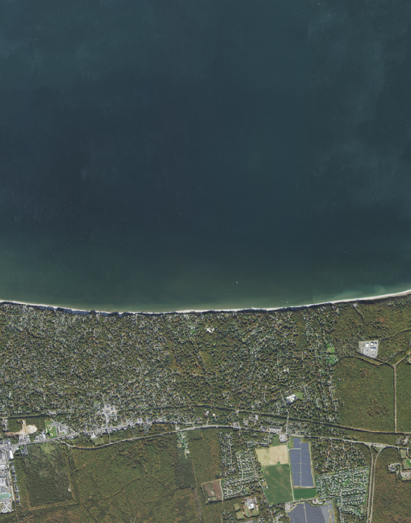
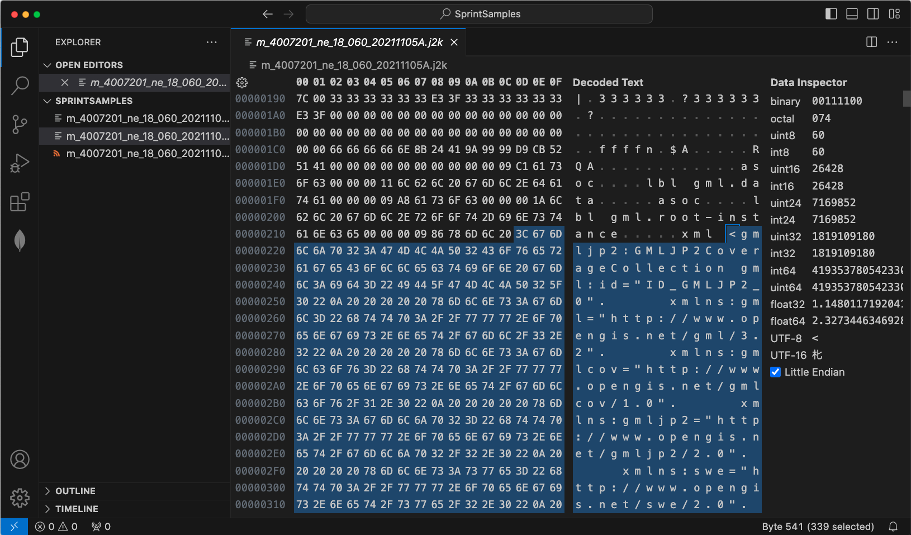
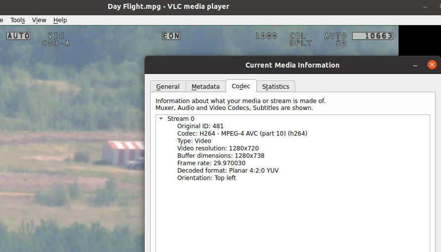
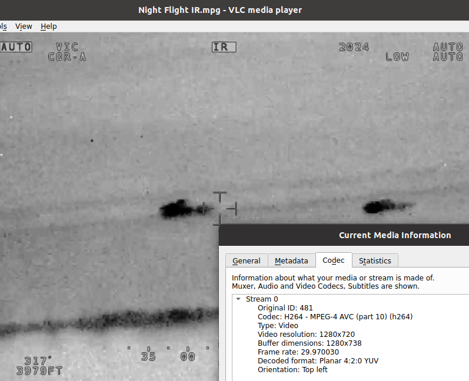
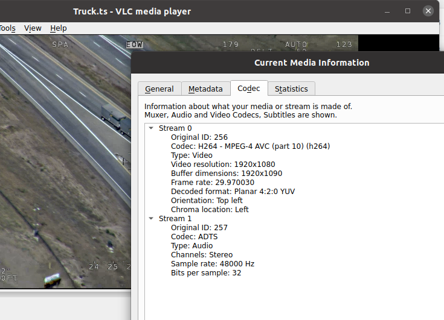

== Sample Input Data Preparation

=== Still aerial imagery

==== 2021 USDA NAIP 4-Band 8 Bit Imagery for New York in GMLJP2

An aerial image was downloaded from NOAA's Data Viewer as shown below.

A search on NOAA's https://coast.noaa.gov/dataviewer/#/imagery/search/-8242213.418872666,4966384.8402726,-8232227.93630649,4975575.795759609/details/9664[Data Viewer] presented a number of aerial images that could be used as input images.

The https://coastalimagery.blob.core.windows.net/digitalcoast/NY_NAIP_2021_9664/index.html[2021 USDA NAIP 4-Band 8 Bit Imagery: New York] set of images was selected for use.

The first image in the set was downloaded using the following curl command.

`curl https://coastalimagery.blob.core.windows.net/digitalcoast/NY_NAIP_2021_9664/m_4007201_ne_18_060_20211105.tif > m_4007201_ne_18_060_20211105.tif`


As the downloaded image was in GeoTIFF format, the image was converted to JPEG2000 using GDAL to embed GMLJP2 georeferecing information inside it.

```
gdal_translate -of JP2OpenJPEG -co GMLJP2V2_DEF=YES -co CODEC=JP2 -co QUALITY=100 -co REVERSIBLE=YES /SprintSamples/m_4007201_ne_18_060_20211105.tif /SprintSamples/m_4007201_ne_18_060_20211105B.jp2
```

A preview of the image is shown below.



Note that the GMLJP2 georeference is emdedded inside the file and can be seen using a Hex Editor (see screenshot below), or exported to a separate file using GDAL.



=== Motion imagery in H.264

==== H.264 files

A couple of sample files are available from the FFMPEG site at https://samples.ffmpeg.org/MPEG2/mpegts-klv/

As shown by the following screenshot, the images contain an H.264 stream.





Esri also publishes a sample motion imagery file at https://www.arcgis.com/home/item.html?id=55ec6f32d5e342fcbfba376ca2cc409a




=== Conversion to HEIF format

A tile set can be generated from the still aerial imagery using gdal2tiles.py through the following command. gdal2tiles is a script that is published with GDAL.

```
gdal2tiles.py --xyz --webp-lossless --tiledriver=WEBP  --zoom=1-18 /home/m_4007201_ne_18_060_20211105B.jp2 /home/tilestore
```

NOTE: Instead of creating intermediate image files in WEBP format, an alternative is to create the intermediate image files in PNG format using the same gdal2tiles script.

The command above will produce WEBP image files. Those WEBP files can then be converted to HEIF format using the following workflow.

First install pillow-heif.

```
python3 -m venv ./.venv    
source ./.venv/bin/activate
pip install --upgrade pillow-heif
```

Then run the following python3 script.

```python

import os
from PIL import Image
from pillow_heif import register_heif_opener

register_heif_opener()


def convert(inputpath,outputpath):
    imageIn = Image.open(inputpath)
    imageIn.save(outputpath,format="heif")


path = './tilestore'

files = []
# r=root, d=directories, f = files
for r, d, f in os.walk(path):
    for file in f:
        if '.webp' in file:
            files.append(os.path.join(r, file))

for f in files:
    print(f + " " + f.replace(".webp",".heic"))
    convert(str(f),str(f.replace(".webp",".heic")))

```

=== Conversion to NGIIS GIMI format

To be added.