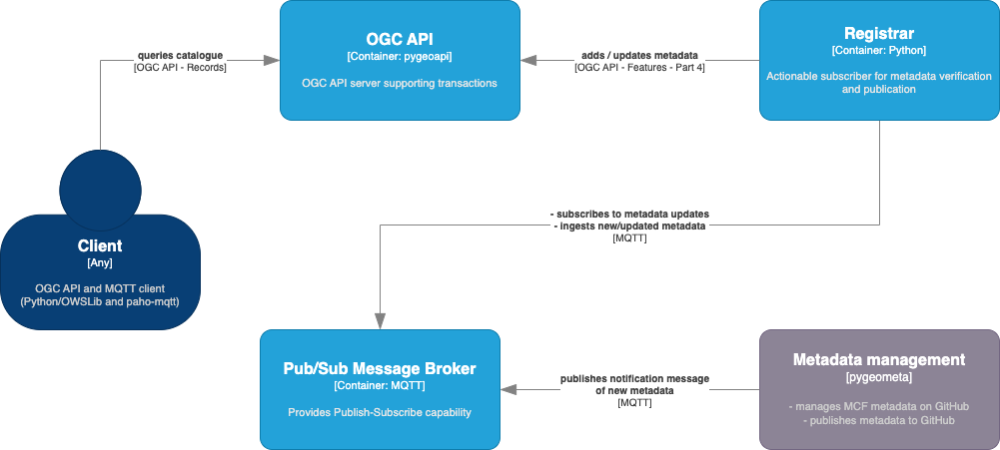

= Tom Kralidis report

== Mentor stream: Metadata management, publishing and discovery using OGC API - Records, Pub/Sub and GitHub

This https://github.com/opengeospatial/developer-events/wiki/2024-Joint-OGC-%E2%80%93-OSGeo-%E2%80%93-ASF-Code-Sprint#metadata-management-publishing-and-discovery-using-ogc-api---records-pubsub-and-github[tutorial] covered how to manage, verify and publish metadata using GitHub as a metadata management platform.  Metadata files are managed as pygeometa MCF records, and GitHub Actions are used to verify, transform and publish notification messages to an MQTT broker.

From here, a metadata registrar is subscribed to the same MQTT broker and, on notification, verifies new/updated metadata and publishes to an OGC API - Records endpoint (powered by pygeoapi) using OGC API - Features - Part 4. The QGIS desktop application is then used to query the OGC API - Records endpoint using its MetaSearch search client.

This session highlighted the use of OGC standards with OSGeo software, as well as "no-code" workflow for low barrier metadata management.

.Container diagram of metadata publication using OGC APIs, Geospatial Python tooling, and GitHub

Tools used:

- https://github.com/wmo-cop/wis2node-metadata-mgmt[wis2node-metadata-mgmt] (metadata management)
- https://geopython.github.io/pygeometa[pygeometa] (metadata formats/translation)
- https://github.com/wmo-im/pywcmp[pywcmp] (WMO Discovery Metadata validator)
- https://pygeoapi.io[pygeoapi] (OGC API server Implementation supporting OGC API - Records)
- https://github.com/wmo-im/wis2-gdc[wis2-gdc] (WMO Catalogue Reference Implementation using pygeoapi, driving by Pub/Sub]
- https://github.com/wmo-im/pywis-pubsub[pywis-pubsub] (WMO WIS2 Pub/Sub utility)

== OGC Team Engine OSGeo incubation

Advice was provided to the OGC Team Engine team in support of OSGeo project https://github.com/opengeospatial/teamengine/issues?q=is%3Aissue+is%3Aopen+sort%3Aupdated-desc+label%3AOSGeo-Graduation[graduation], based on pygeoapi and pycsw Incubation processes.

== pygeoapi

=== OGC API - Coverages updates

Recent updates to OGC API - Coverages removed the `.../domainset` and `../rangetype` endpoints in lieu of folding `...domainset` into collection endpoint responses, and providing a `.../schema` endpoint using JSON Schema in alignment OGC API - Features - Part 5.  This work was https://github.com/geopython/pygeoapi/pull/1548[merged] during the sprint and made available to the core pygeometa codebase.

It was identified that the updates for `.../collections/{collectionId}` could cause confusion, as the `extent.spatial.bbox` object (forced to CRS84) could be different that the `extent.spatial.grid` object, where the latter would be relative to native coordinates.  It was agreed to discuss this in a OGC API - Coverages Standards Working Group meeting.

=== OGC API - Processes clarifications

Discussions with OGC API - Processes - Part 1: Core editors clarified the use of multipart support for execition responses were conditional and not often used in software.  In addition, there are no tests in the OGC API - Processes CITE tests for multipart.

As an implementation, it was decided that pygeoapi would not implement multipart support.

Additional discussions with OGC API - Processes - Part 2: Deploy, Replace, Undeploy editors clarified implementation strategies based the Application Package, Docker, and CWL Requirements Classes.

OGC API - Processes - Part 2: Deploy, Replace, Undeploy implmentation is being planned for implementation in 2024.

=== OGC API - Moving Features implementation

Discussions with the https://github.com/aistairc/mf-api[mf-api] team clarified use and enhancement of pygeoapi in implementing the OGC API - Moving Featurers specification with a default MobilityDB provider.  I advised the mf-api team that adding this functionality in core pygeoapi will be better done once some pygeoapi refactoring is done in the next months (thereby making contributions easier for the mf-api team contribution).

== OWSLib

=== OGC API - Coverages updates

An associated OGC API - Coverages change was made in https://github.com/geopython/OWSLib/pull/908[OWSLib], and https://github.com/geopython/geopython-workshop/pull/154[associated] https://github.com/geopython/diving-into-pygeoapi/pull/134[workshops] in support of the latest updates to OGC API - Coverages.

=== ISO 19115-3 review

The https://github.com/geopython/OWSLib/pull/900[Pull Request] for ISO 19115-3 implemenrtation was reviewed and feedback was provided.  Once feedback is addressed, the work will be merged into the core OWSLib codebase and made available for downstream Python applications.  pycsw will use this work to be ablve to offer CSW and OGC API - Records support based on the ISO 19115-3 standard.

== OGC API - Records

The OGC API - Records Standards Working Group (SWG) met and discussed issues related to the forthcoming submission of OGC API - Part 1: Core as well as future extensions.

=== ATS

As part of OGC API - Part 1: Core, the Abstract Tesat Suite was https://github.com/opengeospatial/ogcapi-records/pull/346[updated] to improve alignment to Requirements Classes.

=== Facets

The current work on https://github.com/opengeospatial/ogcapi-records/pull/320#issuecomment-1966599940[facets] was moved forward by agreeing on a Part 2 - Facets extension with the following Requirements Classes:

- Simple (server defined), allowing for simple facets support with `facets=all` for all server defined facets, or `facets=f1,f2,f3` for an itemized list of same.
- Advanced (deeper client interaction and `.../facets` endpoint), allowing for drilldown workflow for customized facets.

=== pycsw facets implementation

The https://pycsw.org[pycsw] implementation demonstrated the initial ideas of faceting:

- Default `.../items` response:
  - https://demo.pycsw.org/cite/collections/metadata:main/items
  - https://demo.pycsw.org/cite/collections/metadata:main/items?f=json
- `.../items` response with facets:
  - https://demo.pycsw.org/cite/collections/metadata:main/items?facets=true
  - https://demo.pycsw.org/cite/collections/metadata:main/items?f=json&facets=true
