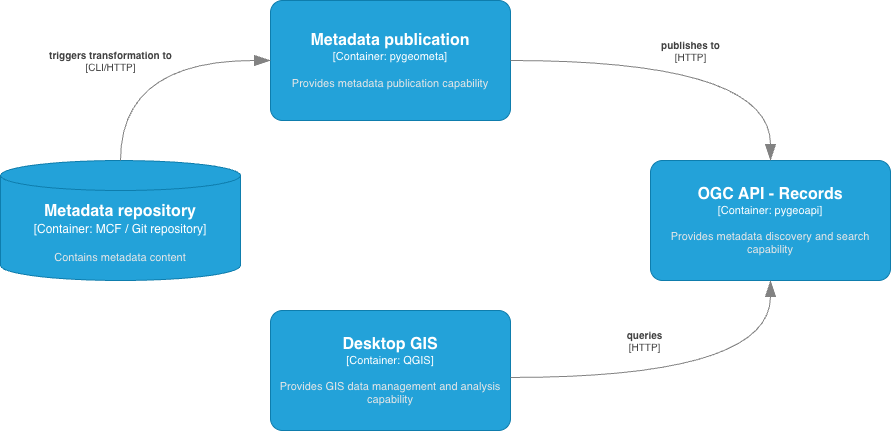
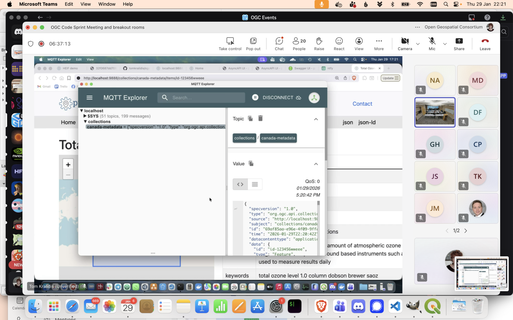
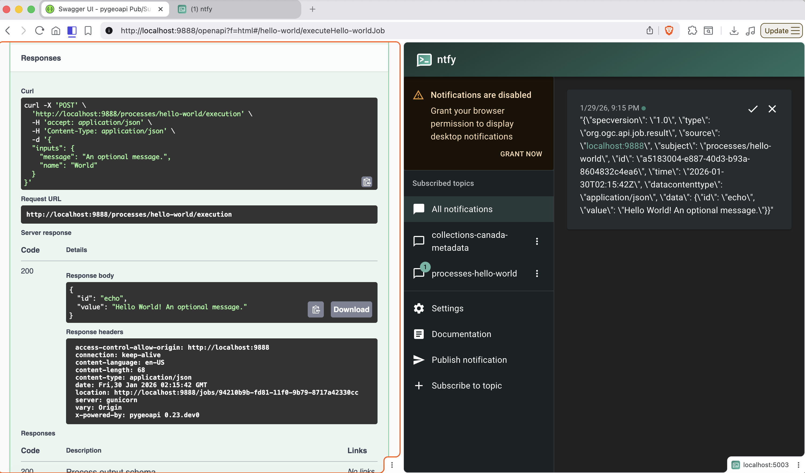
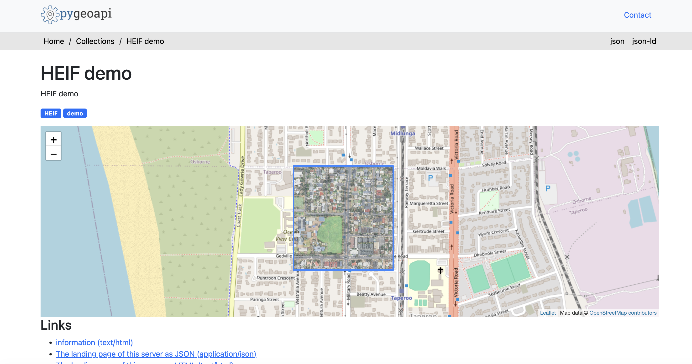

= 2026 Joint OGC – OSGeo – ASF Code Sprint OSGeo report

== Architecture

[[pygeoapi-architecture]]
=== OSGeo pygeoapi

https://pygeoapi.io[pygeoapi] is a Python server implementation of the OGC API suite of Standards. The project emerged as part of the next generation OGC API efforts in 2018 and provides the capability for organizations to deploy a RESTful OGC API endpoint using OpenAPI, GeoJSON, and HTML. pygeoapi is open source and released under an MIT license. pygeoapi is an official OSGeo Project as well as an OGC Reference Implementation. pygeoapi supports numerous OGC API Standards. The https://docs.pygeoapi.io/en/stable/introduction.html#standards-support[official documentation] provides an overview of all supported standards.

[[pygeometa-architecture]]
=== OSGeo pygeometa

https://geopython.github.io/pygeometa[pygeometa] provides a lightweight and Pythonic approach for users to easily create geospatial metadata in standards-based formats using simple configuration files called Metadata Control Files (MCF). The software has minimal dependencies (the installation is less than 50 kB), and provides a flexible extension mechanism leveraging the Jinja2 templating system. Leveraging the simple but powerful YAML format, pygeometa can generate metadata in numerous standards. Users can also create their own custom metadata formats which can be plugged into pygeometa for custom metadata format output. pygeometa is open source and released under an MIT license.

For developers, pygeometa provides a Pythonic API that allows developers to tightly couple metadata generation within their systems and integrate nicely into metadata production pipelines.

The project supports various metadata formats out of the box including ISO 19115, the WMO Core Metadata Profile, OGC API - Records as well as STAC (Item).

[[geonetwork-architecture]]
=== OSGeo GeoNetwork

GeoNetwork is a catalog application for managing spatially referenced resources. It provides metadata editing and search functions as well as an interactive web map viewer.

== Results

[[metadata-mentor-stream]]
=== Metadata management, publishing and discovery using OGC API - Records Mentor Stream

A https://github.com/opengeospatial/developer-events/wiki/2026-Joint-OGC-%E2%80%93-OSGeo-%E2%80%93-ASF-Code-Sprint#metadata-management-publishing-and-discovery-using-ogc-api---records[Mentor stream] on metadata management, publishing and discovery was given to participants, with focus on OSGeo projects pygeoapi, pygeometa and QGIS.

.Metadata publishing lifecycle using pygeoapi, pygeometa, and QGIS

The link:./ogc-sprint-metadata-mentor-stream-2026-01-27.pdf[presentation] provided an recap of the OGC API - Records standard (Parts 1, 2, 3), as well as the WMO Information System (WIS2) as a key implementation of the standard.  Overviews were given on the pygeoapi, pygeometa and QGIS projects, highlighting their main features and extensible capabilities (e.g. developing custom plugins).

.Demonstration of metadata publishing and discovery using OGC API - Records

Resulting discusssion with participants (e.g. USGS) included pygeoapi deployment options, backends (PostgreSQL, Elasticsearch/OpenSearch), as well as metadata workflows, standards and formats.

[[pygeoapi-results]]
=== OSGeo pygeoapi

==== Pub/Sub

The https://docs.ogc.org/DRAFTS/25-030.html[OGC API Publish-Subscribe Workflow - Part 1: Core] draft specification was implemented, enabling support for AsyncAPI provisionin, as well as trigger notifications on feature/record transactions and processe executions.  Pub/Sub clients for MQTT (mosquitto) and HTTP (ntfy) were demonstrated against the following specification Requirements Classes:

- Discovery
- Message payloads - CloudEvents (JSON)

The work was put forth in a https://github.com/geopython/pygeoapi/pull/2220[GitHub Pull Request], reviewed and approved by the pygeoapi team and merged into the master branch.  Resulting documentation can be found in the https://docs.pygeoapi.io/en/latest/pubsub.html[pygeoapi documentation].

As part of the work, https://github.com/geopython/pygeoapi/issues/2223[fixes to DELETE transactions] were also applied.

A Docker Compose based setup can be found in the https://github.com/geopython/pygeoapi-examples/tree/main/pubsub[pygeoapi-examples] GitHub repository for testing and demonstration.  The setup was engineered to use pygeoapi core and minimal Pub/Sub user configuration settings.  The work is Free and Open Source and made available under an MIT license.

.Demonstration of process execution triggering publication of a notification message

=== HEIF

A HEIF map provider plugin in support of OGC API - Maps visualization.  The plugin was developed to perform direct reads of a HEIF image, subsetting in memory and return (PNG) bytes to the client, utilizing the following libraries:

- https://gdal.org[GDAL] (Python bindings)
- https://pypi.org/project/pillow-heif[pillow-heif]
- https://pypi.org/project/numpy[numpy]

The value proposition of the plugin was to ensure no transformation of HEIF data into an OGC API - Maps compatible output.

.Demonstration of HEIF visualization in pygeoapi via OGC API - Maps

An https://github.com/geopython/pygeoapi/pull/2226[additional enhancement] was made to pygeoapi to adjust opacity if a given collection description in HTML mode contained the ability to render a map, and if so, the map rendered was made fully visible as part of the collection footprint.

.Demonstration of HEIF visualization in pygeoapi via OGC API - Maps using QGIS as a client

A Docker Compose based setup can be found on https://github.com/tomkralidis/ogc-sprint-2026-01/tree/main/pygeoapi-heif-maps-demo[GitHub] for testing and demonstration (test data is not included in the repository).  The setup was engineered to use pygeoapi core, the custom HEIF plugin and minimal configuration.  The work is Free and Open Source and made available under an MIT license.

[[pygeometa-results]]
=== OSGeo pygeometa

The pygeometa project was applied into the https://wiki.osgeo.org/wiki/Incubation_Committee#Step_2:_Join_OSGeo_Community_Projects_Initiative:[OSGeo Community Project program] (issue can be found in https://gitea.osgeo.org/osgeo/projects-support/issues/1).  A full curated review was performed prior to submission, including adding a https://www.osgeo.org/projects/pygeometa:[project page to the OSGeo website].  A https://lists.osgeo.org/pipermail/incubator/2026-January/005132.html[motion] has been opened for vote by the OSGeo Incubation Committee as a result (final vote will be complete by 12 February 2026).  An OSGeo Community Project can then progress into an official OSGeo project following an incubation period/activity, as well as a fulsome review of project governance, collaboration, and code provenance review.

== Discussion

The following items were discussed as future steps/work in the context of OGC Standards as well as OSGeo software:

=== Lower barrier metadata lifecycle management

Given the discussions regarding geospatial metadata standards (FGDC, ISO 19115), complexity and transformation issues, the Mentor Stream on metadata lifecycle prompted discussion on low barrier metadata configuration that can used to generate various metadata standards on demand or as part of publication pipelines using tools like https://geopython.github.io/pygeometa[pygeometa] and https://geopython.github.io/pygeometa/reference/mcf/[Metadata Control Files (MCF)] (see https://github.com/geopython/pygeometa/blob/master/sample.yml[example]).

A related Mentor stream was provided in this regard during the https://github.com/opengeospatial/developer-events/wiki/2024-Joint-OGC-%E2%80%93-OSGeo-%E2%80%93-ASF-Code-Sprint#metadata-management-publishing-and-discovery-using-ogc-api---records-pubsub-and-github[2024 Joint OGC – OSGeo – ASF Code Sprint].  The associated example of this approach can be found in the following https://github.com/wmo-cop/wis2node-metadata-mgmt[proof of concept].

image::https://raw.githubusercontent.com/wmo-cop/wis2node-metadata-mgmt/refs/heads/main/docs/workflow.png[]

=== Next steps for OGC API - Publish-Subscribe Workflow - Part 1: Core

Future work in the Pub/Sub SWG to engage with various OGC API Standards Working Groups (SWGs) is planned to define how the specification will be implemented in "downstream" OGC API standards.  2026 Q2 is a target date for consensus across SWGs in order to define and plan further testing at future events and code sprints.

=== pygeoapi OGC API - Maps axis order improvements

The project plans to update OGC API - Maps support to improve axis order support, as per the ``.../map`` ``bbox-crs`` parameter.  Future interoperability experiments for OGC API - Maps will be valuable to help advance implementation and usage as part of migration from Web Map Service (WMS).

=== HEIF implementation

The pygeoapi HEIF implementation can be improved by implementing a catalogue of HEIF images in support of scene selection (or compositing).  Test datasets will be valuable to this exercise.  More readily available open data in HEIF will also help test implementation of the specification.

=== CITE tooling ecosystem

The expansion of CITE tooling was discussed, and the possibility of providing additional tools in a containerized fashion.  For example, for the https://wmo-im.github.io/wcmp2/standard/wcmp2-STABLE.html[WMO Core Metadata Profile], compliance tooling is available via the https://github.com/World-Meteorological-Organization/pywcmp[pywcmp] tool, allowing CLI-based compliance testing on the standard.  The tool is also provided as an online service via pygeoapi (using OGC API - Processes) and is https://wis2-gdc.weather.gc.ca/openapi#/pywcmp-wis2-wcmp2-ets/executePywcmp-wis2-wcmp2-etsJob[deployed] by various WMO Members for online testing, evaluation and continuous improvement.

Providing containerized components can help expand CITE for additional programming languages (like Python, Rust, Go, etc.).

Also discussed was a review process for accepting such tools into the CITE ecosystem.  The https://www.osgeo.org/resources/project-graduation-checklist[OSGeo Project Graduation Checklist] can be considered for suggested criteria.
